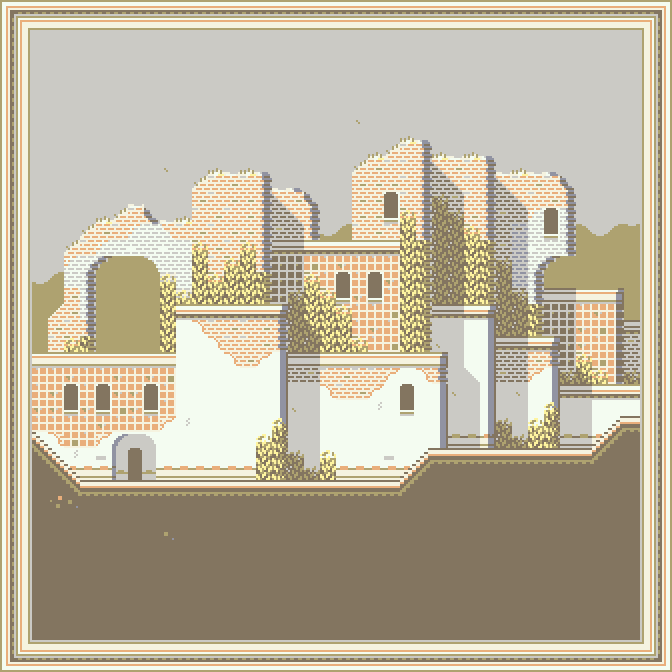

Auxiliary Programs for (Loopy) Belief Propagation
===

This directory includes auxiliary programs and files to generate
tile sets, tile rules, tile names and provide some example
usages for each with the Belief Propagation program included in this
repository.

Example Output Images
===

These images were exported form the [Tiled](https://www.mapeditor.org/) program.

| SMB |
|---|
|  |

| PM |
|---|
|  |

| Amarelo |
|---|
|  |

